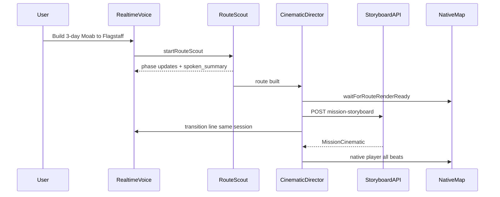

# Co-Pilot AI Cinematic Director — 2026-07-06

## Goal

Ship a single continuous ChatGPT realtime voice flow from voice trip build through
AI-directed cinematic flyover on the main NativeMap tab: push-to-talk → route
scout → spoken transition → full flythrough, with Co-Pilot picking beats and
camera framing via a backend storyboard API backed by the Trailhead Mapbox tool
bridge.

## Architecture

## Completed

### Unified voice session (`mobile/lib/realtimeCopilot.ts`)

- Added `enterDirectorMode`, `exitDirectorMode`, `isConnected`, `setOnNarrationDone` on the live WebRTC handle.
- Director mode mutes mic, disables turn detection, and switches narrator instructions via `session.update`.
- Removed separate `missionNarratorRef` second WebRTC session from `map.tsx`.

### Route-ready gate (`mobile/lib/cinematicDirector.ts`, `map.tsx`)

- `waitForRouteRenderReady` polls `lastRouteCoordsRef` + `routeOverlayReadyRef` (set in `drawScoutRoute`).
- `handoffScoutToCinematic` replaces blind 900ms timeout: wait for route → speak transition → `startMapMissionBrief`.
- Scout phases `windows` / `finalizing` call `realtimeCopilotRef.say()` when voice is active (throttled per phase).

### AI storyboard API (`dashboard/mission_storyboard.py`, `dashboard/server.py`)

- `POST /api/extreme/copilot/mission-storyboard`
- Fetches `trailhead.route_preview` via existing copilot tool bridge for leg context.
- OpenAI structured JSON (`gpt-4o-mini`) picks 8–14 beats with camera modes.
- Python fallback storyboard when OpenAI or bridge fails.
- Mobile client: `api.createMissionStoryboard`, 4s race with deterministic `buildMapMissionCinematic`.

### Voice policy

- Same `realtimeCopilotRef` from build through every cinematic beat.
- Device TTS fallback only after 6s first-beat / 2s later-beat wait when WebRTC is dead.
- `missionVoicePathRef` tracks `realtime` vs `degraded` for QA.

## Files touched

| Area | Path |
|------|------|
| Realtime director | `mobile/lib/realtimeCopilot.ts` |
| Route gate | `mobile/lib/cinematicDirector.ts` |
| Map integration | `mobile/app/(tabs)/map.tsx` |
| API client | `mobile/lib/api.ts` |
| Storyboard backend | `dashboard/mission_storyboard.py` |
| Endpoint | `dashboard/server.py` |
| Tests | `tests/test_mission_storyboard.py` |
| Smoke | `mobile/scripts/mission-briefing-smoke.mjs` |

## Validation

| Checkpoint | Result |
|------------|--------|
| `npx tsc --noEmit` (mobile) | pass |
| `node mobile/scripts/mission-briefing-smoke.mjs` | pass |
| `node mobile/scripts/user-facing-copy-audit.mjs --preset map` | pass |
| `python -m unittest tests.test_mission_storyboard tests.test_copilot_tool_bridge` | pass (9 tests) |

### Manual E2E (device)

1. Map tab → push-to-talk → "build a 3-day camping trip from Moab to Flagstaff"
2. Co-Pilot speaks through scout phases (windows, finalizing)
3. Transition line: "Route's built — I'll fly the plan for you."
4. ChatGPT voice continues through all cinematic beats (no device fallback)
5. NativeMap route overlays + mission brief progress line visible
6. Full flythrough completes through mission recap

## Mapbox MCP path

Production uses the Trailhead copilot tool bridge (`trailhead.route_preview`) server-side.
External Mapbox MCP (`mcp.mapbox.com`) remains for dev/Claude tooling per
`docs/checkpoints/copilot-map-bridge-mcp-audit.md`.

## OTA

Message: `AI cinematic director: unified voice, AI storyboard, seamless scout-to-fly`

| Channel | Update group ID |
|---------|-----------------|
| production | `493a349b-86d0-4278-bb3c-14ecdd79cb12` |
| preview | `dad8443d-6aba-4eda-94bc-285c9fa19adb` |

Runtime: `native-20260614-sdk54-1`
